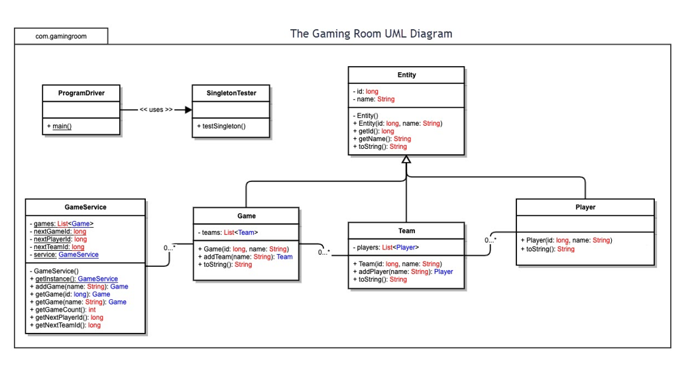

# CS-230 Software Design Document For Draw It Or Lose It. 
#### This Repo includes:
 * Software Design Document. 
 * Mock Authorization Service. 
 * The Game Service - Manages Teams and Users.

### Introduction

 

### The course CS-230 Operating Platforms at Southern New Hampshire University provides an excelent introduction to design concepts such as UML, design patterns, Software Design Templates, Design Constraints, Processing and Threading, Operating System Concepts, Polyglot Programming, Rest, Platform and Software Security, Memory, and Storage Management, Writing a Software Design Document, and cloud computing.  

 

### Throughout the course, we focused on a mock client - The Gaming Room, to help develop their application Draw It or Lose It. The lessons consisted of implementing a Game Service based on a Domain Design Pattern, which used a singleton design pattern to limit the application to one instance where three classes (Game, Team, and Player) would inherit from one Entity class. 

 

### The Gaming Room wanted your mock organization Chada Tech to design a cross-platform implementation of their preexisting Android Solution. We would use Java and libraries such as Jetty for HTTP, Jersey for REST APIs, and Jackson for JSON support to develop a cross-platform application.

 

### This course has a lot of angles to it. Considering UML, Design Patterns, Software Design Documents, and the operating platform logic, it's hard for me to pinpoint what I did well in this course. I would have to say keep my head on straight while trying to ingest the vast amount of information. While I know some amount of Java and a great deal about how computers operate, coming at it from this perspective was a challenge. Because computing has changed dramatically over the years with cloud computing, it was a challenge to figure out how to approach items such as writing a software design document while also explaining complex low-level platform-specific subjects such as memory and storage or RSA encryption. As I said, I kept my head on straight.

 

 

### UML diagrams are helpful once you know the basics of a language such as Java. They're extremely helpful when designing an application such as the Game Service and guide the development process.

 

### I would improve the current design by adding a UML diagram for the Authenticator. Next integrating the game service into the Game Authenticator, and finaly add a GUI in HTML or use a library such as REACT. 

 

### A significant element of this lesson was gathering User Requirements and then considering Design Constraints. This is the whole point of a Software Design Document. In future endeavors, this method can help communicate a plan of action with a client and guide the design process. A good thing about my experience in this class is that I was also taking a course on the Software Development Life Cycle, which covers Agile and Scrum. The importance of understanding user requirements has been well emphasized in my education and worked into my development process. I would improve this document by adding the Agile/Scrum angle to the Software Design Document and process as a whole. I would then convert Requirements to User Stories while considering Design Constraints. 

 

### From this lesson, we approach the designing software by communicating with a client to gather requirements and then consider the design constraints. Then develop a UML diagram defining the program class structure and possibly utilize a design pattern. This practice would minimize guesswork and improve time to market. 

 

#### 

 

#### TODO: 
 - [ ] Tie the Game service into the Authorization system.
 - [ ] Create a suitable front end.
 - [ ] Get the service running in Azure or antoher cloud provider.

